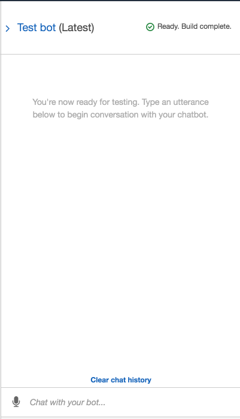

# Robo advisor

*Photo by [Alex Knight](https://www.pexels.com/@alex-knight-1272316?utm_content=attributionCopyText&utm_medium=referral&utm_source=pexels) from [Pexels](https://www.pexels.com/photo/high-angle-photo-of-robot-2599244/?utm_content=attributionCopyText&utm_medium=referral&utm_source=pexels) | [Free License](https://www.pexels.com/photo-license/)*

### Background

 To increase client portfolio, especially by engaging young people. Since machine learning and NLP are disrupting finance to improve customer experience, creating a robo advisor that could be used by customers or potential new customers to get investment portfolio recommendations for retirement.

In this repository, Amazon Web Services and  Python skills are used to create a bot that will recommend an investment portfolio for a retirement plan.

